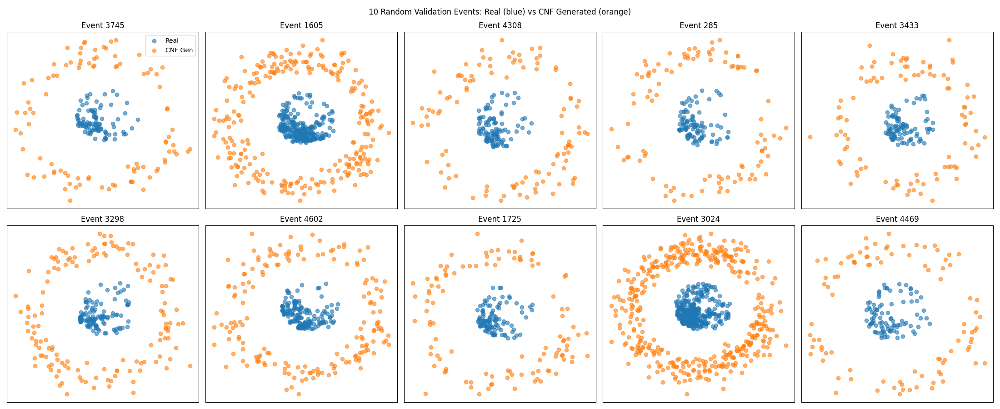

#     esi-fastlight ⎯ Fast Synthetic Hitmap Generator for the pfRICH Detector

**esi-fastlight** is a *conditional continuous‑normalizing‑flow (CNF)* model that synthesises **Proximity‑Focusing RICH** (pfRICH) detector hitmaps entirely in PyTorch.

* Generate physics‑realistic hitmaps in milliseconds—no Geant4 installation or GPU ray tracing needed using this model  
* Test tracking or clustering algorithms with unlimited synthetic events
* Train downstream ML models on diverse, physics‑consistent data

---

## Quick Start
~~~bash
# clone
git clone https://github.com/BNLNPPS/esi-fastlight
cd esi-fastlight/

#  dependencies
torch>=2.2
torchdyn
torchdiffeq
numpy
matplotlib

# train the CNF 
python3.9 TrainingCNF.py
~~~
After training, a figure pops up comparing **real** (Geant4/GPU MC simulation) vs **generated** hitmaps for ten random validation events.

## Method

| Component              | Details |
| ---------------------- | ---------------------------------------------------------------------------------------------------------------------------------------- |
| **Model**              | Conditional Neural ODE / Continuous Normalizing Flow (CNF) implemented with **torchdyn** + **torchdiffeq**                              |
| **Conditioning**       | Event‑ID embedding concatenated with coordinates and integration time `t` (for now just using X,Y)                                       |
| **Architecture**       | Layers of MLP with SiLU activations and LayerNorm                                                                                       |
| **Prior**              | Standard 2‑D Gaussian                                                                                                                    |
| **Training objective** | Maximum likelihood (negative log‑likelihood of mapped samples)                                                                           |
| **Optimization**       | AdamW (5 × 10⁻⁴), weight decay 1 × 10⁻⁴, gradient clipping 1.0, ReduceLROnPlateau scheduler                                             |
| **Data**               | Parsed `(x, y)` hit positions from `opticks_hits_output.txt`; split 70 / 15 / 15 % into train / val / test on *event* granularity        |

## Results

| Metric | Validation (↓) |
| ------ | -------------- |
| **NLL** | ~**x.xx** after 50 epochs (batch 1024)\* |

\* Exact value depends on dataset and RNG seed.

## Usage

### 1. Training from Scratch
~~~bash
python3.9 TrainingCNF.py
~~~

## Validation vs Real Plot

This figure compares **randomly generated synthetic hitmaps** from the CNF model to **real hitmaps** from the validation dataset.

> 📌 **Note:**  
> The model was trained on a **small dataset**, which is why there's a visible difference between the validation and real hitmaps. This is expected and will improve with more data and refinement.

The plot shows **(X, Y)** coordinate distributions of detector hits. Currently, only spatial features are modeled. **Time information** will be integrated in future versions to capture temporal dynamics more realistically.
