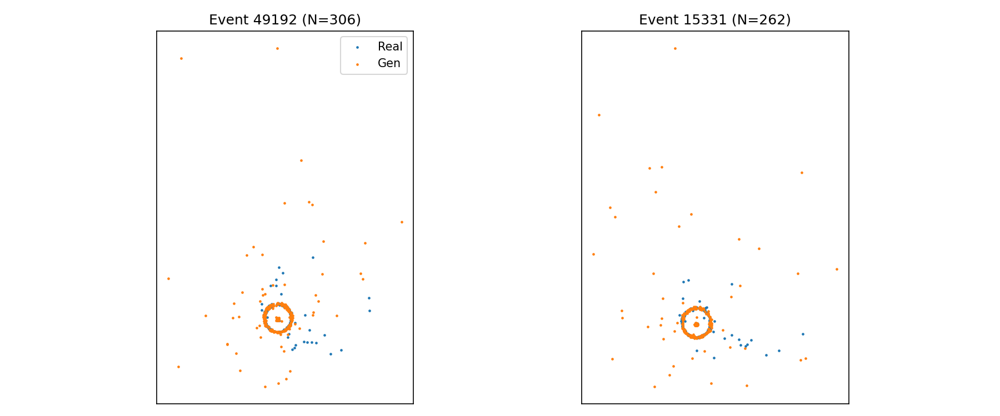

#     esi-fastlight ⎯ Fast Synthetic Hitmap Generator for the pfRICH Detector

**esi-fastlight** is a *compact conditional continuous-normalizing-flow (CNF)* framework that synthesises **Proximity-Focusing RICH** (pfRICH) detector hitmaps entirely in PyTorch.

* Generate physics-realistic hitmaps in **microseconds per event** – no Geant4 installation or GPU ray tracing required  
* Stress-test tracking / clustering algorithms with **unlimited synthetic events**  
* Train downstream ML models on diverse, physics-consistent data

---

## Quick Start
~~~bash
# clone
git clone https://github.com/BNLNPPS/esi-fastlight
cd esi-fastlight/

# minimal dependencies  (Python ≥3.9)
pip install torch>=1.13 torchdiffeq matplotlib numpy

# train the unconditional CNF  (≈ 8 min on an RTX 4090, ~1 h on laptop GPU)
python3 train_cnf_amp_fast_compat.py
~~~
During training, PNGs in **./progress/** compare **real** (Geant4 / Opticks) vs **generated** hitmaps every 20 epochs.

---

## Method (overview)

| Component              | Details |
| ---------------------- | -------------------------------------------------------------------------------------------------------------------------------------------------------------------------------------------------------- |
| **Model**              | Compact CNF (Neural ODE) implemented in **pure PyTorch + torchdiffeq**                                                                                            |
| **Conditioning**       | *None yet* – prototype learns unconditional X-Y response; a conditional version is provided for multiplicity-aware sampling                                       |
| **Architecture**       | 3-layer MLP, widths 128 → 128 → 64, **SiLU** activations (≈ 100 k parameters)                                                                                      |
| **Prior**              | Mixture of thin ring (Cherenkov rim) + tight Gaussian centre + wide Gaussian noise                                                                                |
| **Training objective** | Maximum log-likelihood (negative log-probability of mapped samples)                                                                                               |
| **Optimisation**       | AdamW (lr 3 × 10⁻⁴), gradient clipping 0.5, AMP mixed precision (`torch.cuda.amp`)                                                                                 |
| **Data**               | Parsed `(x, y)` hit positions from **opticks_hits_output.txt**; split **70 / 15 / 15 %** into train / val / test on *event* granularity                            |
| **Speed-ups**          | Fixed-step RK4 (≈ 20 NFEs) instead of adjoint Dopri5; smaller network; AMP; optional GPU                                                                           |

---

## Results (snapshot)

| Metric | Validation (↓) |
| ------ | -------------- |
| **NLL** | ~**x.xx** after 200 epochs (batch 512)\* |

\* Exact value depends on dataset size and RNG seed.

---

## Usage

### 1 · Train the CNF from Scratch
~~~bash
python3 **`TrainingCNF.py`**
~~~

### 2 · Generate a **large synthetic dataset**  
The script **`SynthEvents.py`** samples tens-of-thousands of full events with realistic hit multiplicities while keeping GPU RAM low.

~~~bash
# prerequisite: a trained conditional checkpoint + counts.npy multiplicity histogram
python3 SynthEvents.py \
        --ckpt cnf_condN_iso.pt \
        --num-events 50000 \
        --output events.npz \
        --hits-per-batch 250000 \
        --chunks 3
~~~

**What the script does**

* Streams latent samples in manageable batches through a *Sampler ODE* (no log-probability tracking).  
* Writes hits to a memory-mapped binary file and stores an index array → **events.npz** wrapper.  
* Saves 10 quick-look PNGs in **./synth/** to visually verify the synthetic data.  

---

## Validation vs Real Plot

Blue – **real** hitmaps from validation data • Orange – **synthetic** events from the CNF.  
Only spatial hit distributions are modelled; **time-of-hit** conditioning will arrive in a future release.
